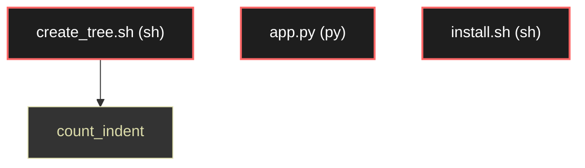

# Polyglot Codebase Knowledge Graph

> Generated offline by **readmenator**. Supports C, C++, Python, Go, Rust, JS/TS, Java, C#, Shell, PHP, Dart, GDScript, Nim, ASM.
> No LLMs. No tokens. Pure static analysis.

**Total Files Parsed:** 3 | **Total Symbols Extracted:** 1 | **Total Imports:** 0

## Structural Knowledge Map

---

## Architecture Reference

### PY (1 files)

#### `app.py`
**Path:** `app.py`

*No symbols extracted*

### SH (2 files)

#### `create_tree.sh`
**Path:** `create_tree.sh`

**Functions:**
- `count_indent` (line 18) - *Función para contar el nivel de indentación (basado en │ y espacios)*

#### `install.sh`
**Path:** `install.sh`

*No symbols extracted*
